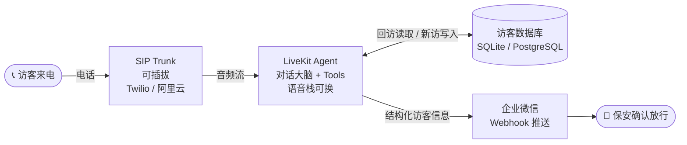

# 语音 AI 访客登记系统

工业园区电话访客自动登记：访客来电 → Voice Agent 拟人对话采集信息 → 企业微信推送保安确认放行。

**硬指标**：接通到微信消息发出 ≤ 25 秒 · 全程拟人，不机械问答

---

## 架构图



---

## 两套配置对照

| 接缝 | `demo` | `china_landing` |
|------|--------|-----------------|
| **SIP Trunk** | LiveKit Phone Numbers 或 Twilio | 阿里云语音 SIP |
| **STT** | OpenAI Realtime API | 国内 ASR（阿里云/讯飞） |
| **LLM** | GPT-4o | Qwen / DeepSeek / GLM（OpenAI 兼容端点） |
| **TTS** | OpenAI TTS | Qwen3-TTS |
| **数据库** | SQLite | PostgreSQL |

> 切换方式：修改 `VOICE_PROFILE` 环境变量，Agent 业务逻辑零改动。

---

## 目录结构

```
src/agent/          # LiveKit worker 入口、session 组装、对话 prompt
src/telephony/      # SIP 接入：inbound 处理、dispatch、trunk 配置说明
src/voice/          # 语音栈 factory + demo / china_landing profiles
src/tools/          # function tools：visitor / wechat / guard（加功能只加文件）
src/data/           # ORM 模型、db 连接工厂、schema.sql
src/config/         # 环境变量加载、profile 选择
scripts/            # SIP trunk 配置脚本、本地启动脚本
tests/              # tools / session / telephony 测试
docs/               # 架构决策记录
```

---

## 部署步骤

### 1. 安装依赖

```bash
python3 -m venv .venv
source .venv/bin/activate
pip install -e ".[dev]"
```

### 2. 配置环境变量

```bash
cp .env.example .env
# 编辑 .env：填写 LIVEKIT_* 和 OPENAI_API_KEY（demo profile）
```

### 3. 配置 SIP Dispatch Rule（一次性）

**demo — LiveKit Phone Numbers（推荐，零配置最快）**

LiveKit 托管号不需要自建 inbound trunk。号码在 LiveKit Cloud 控制台购买后，只需创建一条 dispatch rule 把来电路由到 `visitor-agent`：

```bash
python scripts/setup_sip_trunk.py           # --provider livekit 是默认值
# 输出：INFO created dispatch rule (managed): id=SDR_xxx  agent=visitor-agent
```

> 如果 dashboard 里已手动建过 dispatch rule，跳过此步；若脚本误建了重复规则，用 `--cleanup` 清理：
> ```bash
> python scripts/setup_sip_trunk.py --cleanup --yes
> ```

查看当前状态：
```bash
python scripts/setup_sip_trunk.py --list
```
目标状态：**0 个自建 trunk + 1 条指向 `visitor-agent` 的 dispatch rule**。

**demo — Twilio Elastic SIP Trunk（备选，自带号码）**
1. 在 Twilio 控制台创建 Elastic SIP Trunk，Origination URI 指向 LiveKit SIP 地址
2. 将号码填入 `.env` 的 `TWILIO_PHONE_NUMBER`
3. `python scripts/setup_sip_trunk.py --provider twilio`

**china_landing — 阿里云 SIP（落地时替换）**
见 [src/telephony/trunks/aliyun.md](src/telephony/trunks/aliyun.md)，`--provider aliyun`

### 4. 初始化数据库

```bash
# TODO: python scripts/init_db.py
```

### 5. 启动 Agent Worker

```bash
# 开发模式（自动重载）
bash scripts/start_dev.sh

# 或手动
source .venv/bin/activate
python -m src.agent.worker dev
```

Worker 启动后会连接 LiveKit server，注册 `visitor-agent`，等待来电 dispatch。

> **TODO**：补充 Docker Compose 一键启动、生产环境 PostgreSQL 迁移步骤。

---

## 环境变量

| 变量 | 必填 | 说明 |
|------|------|------|
| `VOICE_PROFILE` | ✅ | 语音栈配置：`demo` \| `china_landing` |
| `LIVEKIT_URL` | ✅ | LiveKit server WebSocket 地址 |
| `LIVEKIT_API_KEY` | ✅ | LiveKit API Key |
| `LIVEKIT_API_SECRET` | ✅ | LiveKit API Secret |
| `OPENAI_API_KEY` | demo | OpenAI API Key |
| `TWILIO_ACCOUNT_SID` | demo | Twilio 账号 SID |
| `TWILIO_AUTH_TOKEN` | demo | Twilio Auth Token |
| `TWILIO_PHONE_NUMBER` | demo | Twilio 接入号码 |
| `ALIYUN_SIP_ACCESS_KEY` | china | 阿里云 AccessKey |
| `ALIYUN_SIP_ACCESS_SECRET` | china | 阿里云 AccessSecret |
| `ALIYUN_PHONE_NUMBER` | china | 阿里云接入号码 |
| `CHINA_LLM_BASE_URL` | china | 国内 LLM OpenAI 兼容端点 |
| `CHINA_LLM_API_KEY` | china | 国内 LLM API Key |
| `CHINA_LLM_MODEL` | china | 模型名称（如 `qwen-plus`） |
| `CHINA_ASR_APPKEY` | china | 国内 ASR AppKey |
| `CHINA_TTS_APPKEY` | china | 国内 TTS AppKey |
| `DATABASE_URL` | 可选 | 留空用 SQLite；填 PostgreSQL DSN 用于生产 |
| `WECHAT_WEBHOOK_URL` | ✅ | 企业微信 Webhook 地址 |

完整示例见 [.env.example](.env.example)。
